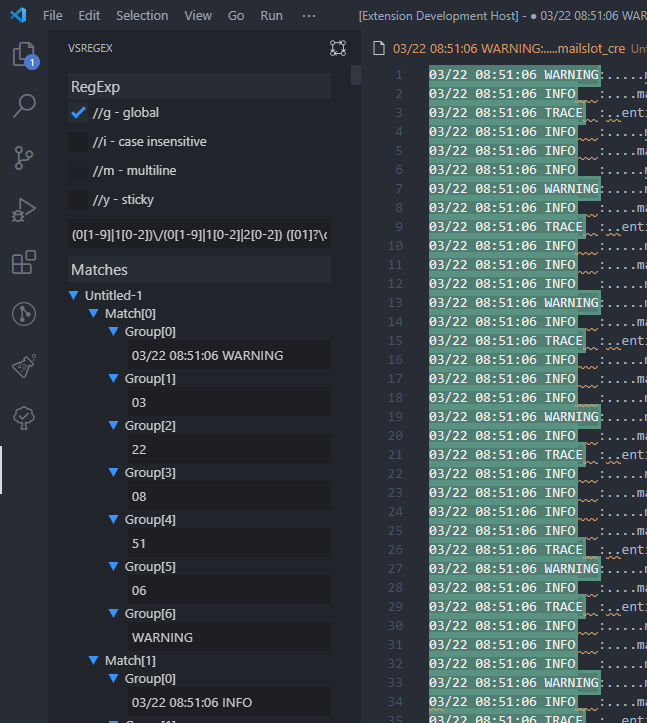

# VSRegex
This is a VS Code extension to test and create regular expressions. 
Use it to...

<table>
	<tr>
		<th>... test in praxis.</th>
		<th>... understand the patter.</th>
	</tr>
	<tr>
		<td></td>
		<!-- TODO update image with new feature -->
		<td></td> 
	</tr>
</table>

## Roadmap
- add explain webview that explain the regex by diagram and text (material: https://code.visualstudio.com/api/extension-guides/webview)
- Improve sidebar ui with collapse fields like on regex101
- publish 0.2.0-alpha (material: https://code.visualstudio.com/api/working-with-extensions/publishing-extension)
- check if possible/useful to build a drag drop regex builder

## Tokens
### Common token
* `[abc]` A single character of: a, b or c
* `[^abc]` A character except: a, b or c
* `[a-z]` A character in the range: a-z
* `[^a-z]` A character not in the range: a-z
* `[a-zA-Z]` A character in the range: a-z or A-Z
* `.` Any single character
* `a|b` Alternate - match either a or b
* `\s` Any whitespace character
* `\S` Any non-whitespace character
* `\d` Any digit
* `\D` Any non-digit
* `\w` Any word character
* `\W` Any non-word character
* `(?:...)` Match everything enclosed
* `(...)` Capture everything enclosed
* `a?` Zero or one of a
* `a*` Zero or more of a
* `a+` One or more of a
* `a{3}` Exactly 3 of a
* `a{3,}` 3 or more of a
* `a{3,6}` Between 3 and 6 of a
* `^` Start of text
* `$` End of text
* `\b` A word boundary
* `\B` Non-word boundary
### General token
* `\n` Newline
* `\r` return
* `\t` Tab
* `\0` Null character
### Anchors token
* `\G` Start of match
* `^` Start of text
* `$` End of text
* `\A` Start of string
* `\Z` End of string
* `\z` Absolute end of string
* `\b` A word boundary
* `\B` Non-word boundary
### Meta Sequences token
* `.` Any single character
* `a|b` Alternate - match either a or b
* `\s` Any whitespace character
* `\S` Any non-whitespace character
* `\d` Any digit
* `\D` Any non-digit
* `\w` Any word character
* `\W` Any non-word character
* `\X` Any Unicode sequences, linebreaks included
* `\C` Match one data unit
* `\R` Unicode newlines
* `\N` Match anything but a newline
* `\v` Vertical whitespace character
* `\V` Any non-whitespace character
* `\h` Horizontal whitespace character
* `\H` Negation of \h
* `\K` Reset match
* `\#` Match subpattern number #
* `\pX` Unicode property X
* `\p{...}` Unicode property or script category
* `\PX` Negation of \pX
* `\P{...}` Negation of \p
* `\Q...\E` Quote; treat as literals
* `\k{name}` Match subpattern `name`
* `\k<name>` Match subpattern `name`
* `\k'name'` Match subpattern `name`
* `\gn` Match nth subpattern
* `\g{n}` Match nth subpattern
* `\g{-n}` Match text the nth relative previous subpattern matched
* `\g<n>` Recurse nth capture group
* `\g<+n>` Recurse nth relative upcoming subpattern
* `\g'n'` Recurse nth capture group.
* `\g'+n'` Recurse nth relative upcoming subpattern
* `\g{letter}` Match previously-named capture group `letter`
* `\g<letter>` Recurse named capture group `letter`
* `\g'letter'` Recurse named capture group `letter`
* `\xYY` Hex character YY
* `\x{YYYY}` Hex character YYYY
* `\ddd` Octal character ddd
* `\cY` Control character Y
* `[\b]` Backspace character
* `\` Makes any character literal
### Quantifiers token
* `a?` Zero or one of a
* `a*` Zero or more of a
* `a+` One or more of a
* `a{3}` Exactly 3 of a
* `a{3,}` 3 or more of a
* `a{3,6}` Between 3 and 6 of a
* `a*?` Lazy quantifier
* `a*+` Possessive quantifier
### Group Constructs token
* `(?:...)` Match everything enclosed
* `(...)` Capture everything enclosed
* `(?&gt;...)` Atomic group (non-capturing)
* `(?|...)` Duplicate/reset subpattern group number
* `(?#...)` Comment group
* `(?'name'...)` Named Capturing Group
* `(?&lt;name&gt;...)` Named Capturing Group
* `(?P&lt;name&gt;...)` Named Capturing Group
* `(?imsxUJnxx)` Inline modifiers
* `(?imsxUJnxx:...)` Localized inline modifiers
* `(?(1)yes|no)` Conditional statement
* `(?(R)yes|no)` Conditional statement
* `(?(R#)yes|no)` Recursive Conditional statement
* `(?(R&amp;name)yes|no)` Conditional statement
* `(?(?=...)yes|no)` Lookahead conditional
* `(?(?&lt;=...)yes|no)` Lookbehind conditional
* `(?R)` Recurse entire pattern
* `(?1)` Recurse first subpattern
* `(?+1)` Recurse first relative subpattern
* `(?&amp;name)` Recurse subpattern `name`
* `(?P=name)` Match subpattern `name`
* `(?P&gt;name)` Recurse subpattern called `name`
* `(?(DEFINE)...)` Pre-define patterns before using them
* `(?=...)` Positive Lookahead
* `(?!...)` Negative Lookahead
* `(?&lt;=...)` Positive Lookbehind
* `(?&lt;!...)` Negative Lookbehind
* `(*ACCEPT)` Control verb
* `(*FAIL)` Control verb
* `(*MARK:NAME)` Control verb
* `(*COMMIT)` Control verb
* `(*PRUNE)` Control verb
* `(*SKIP)` Control verb
* `(*THEN)` Control verb
* `(*UTF)` Pattern modifier
* `(*UTF8)` Pattern modifier
* `(*UTF16)` Pattern modifier
* `(*UTF32)` Pattern modifier
* `(*UCP)` Pattern modifier
* `(*CR)` Line break modifier
* `(*LF)` Line break modifier
* `(*CRLF)` Line break modifier
* `(*ANYCRLF)` Line break modifier
* `(*ANY)` Line break modifier
* `\R` Line break modifier
* `(*BSR_ANYCRLF)` Line break modifier
* `(*BSR_UNICODE)` Line break modifier
* `(*LIMIT_MATCH=x)` Regex engine modifier
* `(*LIMIT_RECURSION=d)` Regex engine modifier
* `(*NO_AUTO_POSSESS)` Regex engine modifier
* `(*NO_START_OPT)` Regex engine modifier
### Character Classes token
* `[abc]` A single character of: a, b or c
* `[^abc]` A character except: a, b or c
* `[a-z]` A character in the range: a-z
* `[^a-z]` A character not in the range: a-z
* `[a-zA-Z]` A character in the range: a-z or A-Z
* `[[:alnum:]]` Letters and digits
* `[[:alpha:]]` Letters
* `[[:ascii:]]` ASCII codes 0-127
* `[[:blank:]]` Space or tab only
* `[[:cntrl:]]` Control characters
* `[[:digit:]]` Decimal digits
* `[[:graph:]]` Visible characters (not space)
* `[[:lower:]]` Lowercase letters
* `[[:print:]]` Visible characters
* `[[:punct:]]` Visible punctuation characters
* `[[:space:]]` Whitespace
* `[[:upper:]]` Uppercase letters
* `[[:word:]]` Word characters
* `[[:xdigit:]]` Hexadecimal digits
* `[[:&lt;:]]` Start of word
* `[[:&gt;:]]` End of word
### Flag/Modifiers token
* `g` Global
* `m` Multiline
* `i` Case insensitive
* `x` Ignore whitespace / verbose
* `s` Single line
* `u` Unicode
* `X` eXtra
* `U` Ungreedy
* `A` Anchor
* `J` Duplicate group names
### Substitutions token
* `$1` Contents in capture group 1
* `${foo}` Contents in capture group `foo`
* `\x20` Hexadecimal replacement values
* `\x{06fa}` Hexadecimal replacement values
* `\t` Tab
* `\r` Carriage return
* `\n` Newline
* `\f` Form-feed
* `\U` Uppercase Transformation
* `\L` Lowercase Transformation
* `\E` Terminate any Transformation
