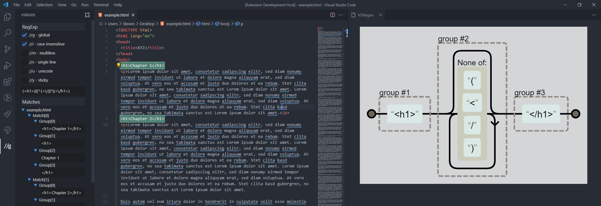

# VSRegex
This is a VS Code extension to test and create regular expressions.

## Third Party
The rendering part is a [library](https://github.com/StevenCyb/regexper-lib) I have created based on the implementation [regexper-static by Jeff Avallone](https://gitlab.com/javallone/regexper-static). He has worked out a cool regular expression visualization [site](https://regexper.com/), check it out. The license for his project can be found [here](https://gitlab.com/javallone/regexper-static/-/blob/master/LICENSE.txt).